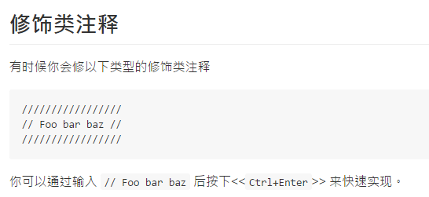

### DockBlockr中，//模式不能直接用Ctrl+Enter跳出，得到的一个结果是
```
/////////////////
// Foo bar baz //
/////////////////
```
后来在[gitbooks上一篇DockBlockr的教程](https://nicesu.gitbooks.io/sublime-text-guide/content/plug-in/docblockr.html)中看到了关键词，,于是我直接去DockBlockr的配置文件中去搜索 dec这个关键词，看到了一个配置项，Bingo！
```
// If set to true, Ctrl+Enter while in a single line comment will 'decorate' the comment.
"jsdocs_decorate": true,
```
关闭这个小“特性”后，省去了很多Del //操作